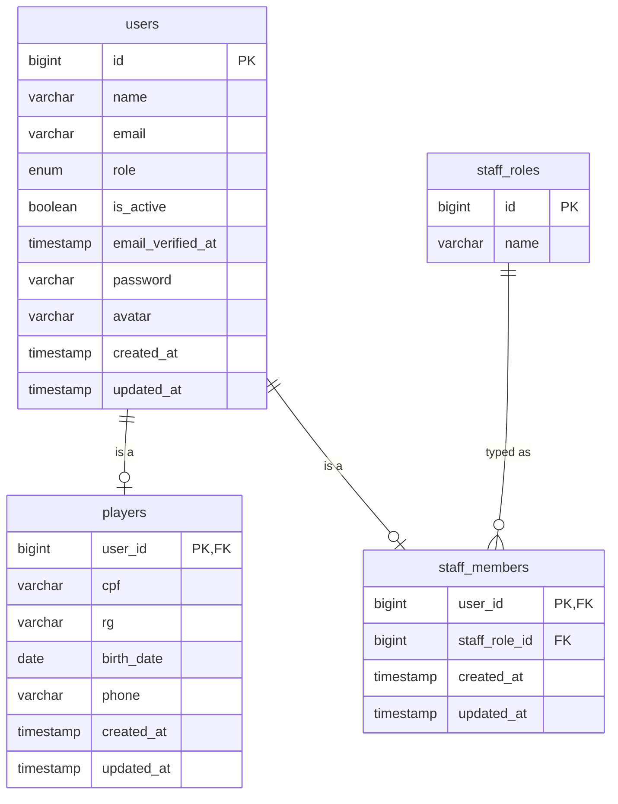
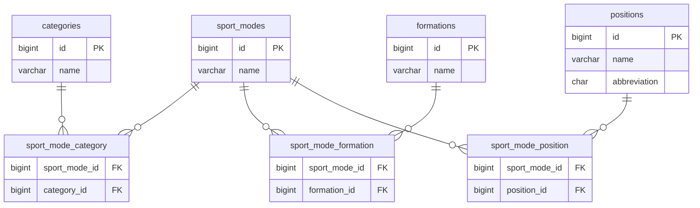
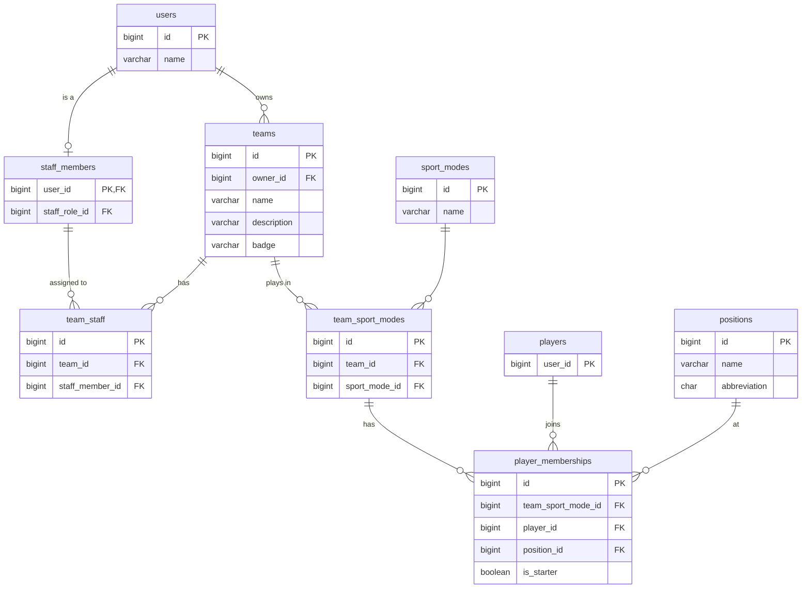
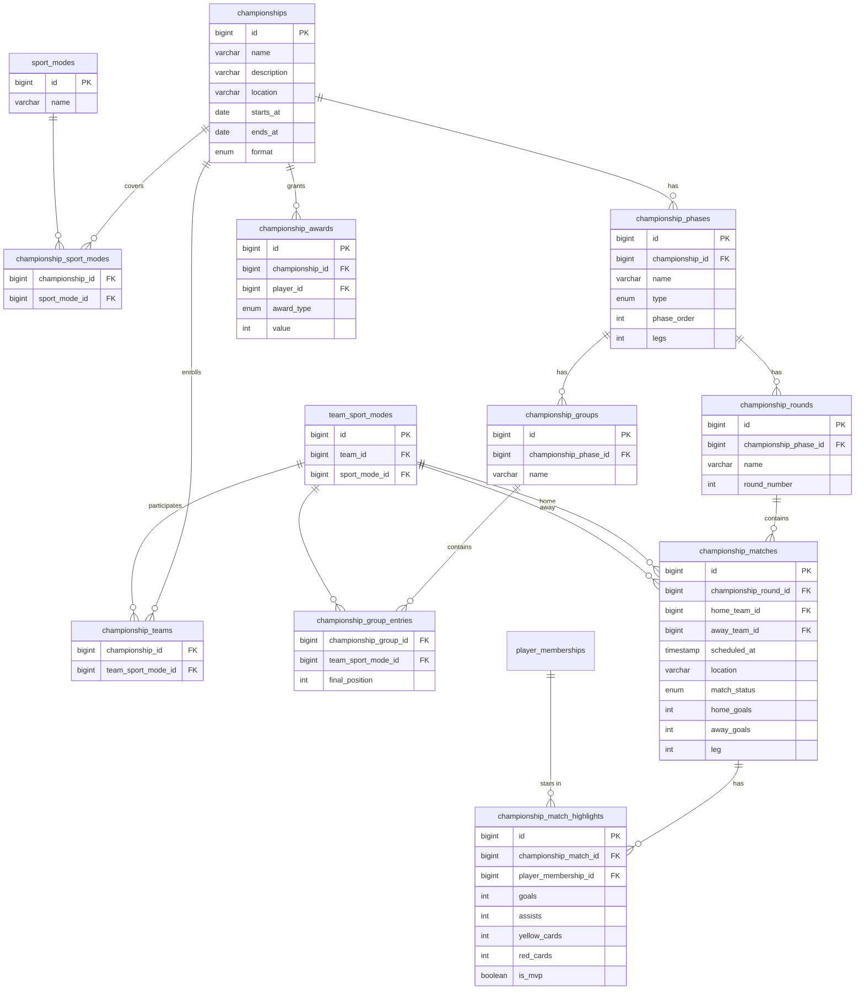
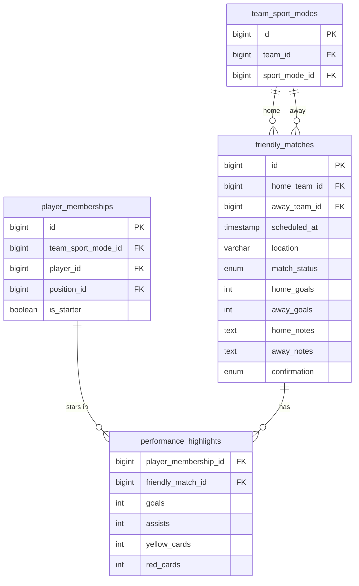
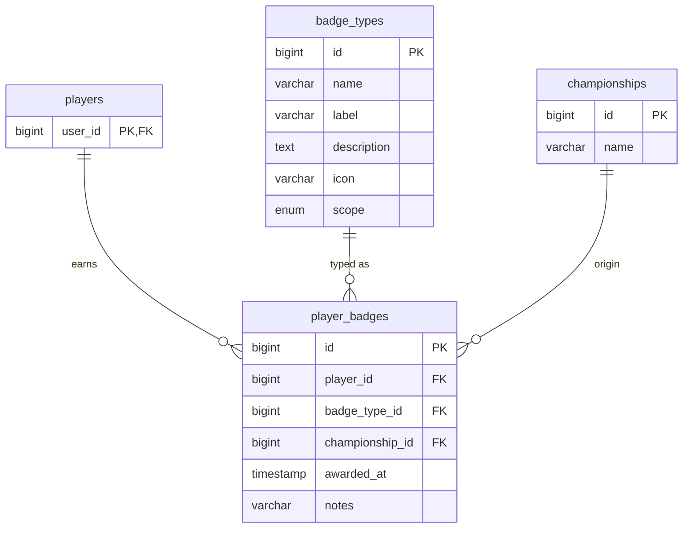

# Schema do Banco de Dados — MyClub

## Visão geral

Este documento analisa o banco legado (`Banco de dados/dump_myclub.sql`) e propõe o mapeamento para o novo domínio, organizado por contexto, com nomes de modelos em inglês conforme as convenções do projeto.

O legado é tratado como **referência funcional**, não como contrato estrutural. A nova base será reconstruída com migrations Laravel, nomenclatura em inglês e modelagem corrigida.

> **Convenção global:** todas as tabelas incluem `created_at` e `updated_at` por padrão (Laravel timestamps). Pivôs devem usar `->timestamps()` na migration e `withTimestamps()` no relacionamento Eloquent.

---

## Índice de contextos

1. [Identidade e Usuários](#1-identidade-e-usuários)
2. [Configurações Esportivas](#2-configurações-esportivas)
3. [Times e Elencos](#3-times-e-elencos)
4. [Campeonatos](#4-campeonatos)
5. [Partidas e Desempenho](#5-partidas-e-desempenho)
6. [Badges de Jogador](#6-badges-de-jogador)
7. [Ranking de Times](#7-ranking-de-times)
8. [Schema completo](#8-schema-completo)
9. [Observações de modelagem](#9-observações-de-modelagem)

---

## 1. Identidade e Usuários

Base de acesso do sistema. Usuários podem ter perfis especializados — jogador ou membro da comissão técnica — que estendem o usuário base.

### Mapeamento de tabelas

| Tabela legada | Modelo novo     | Descrição                                   |
| ------------- | --------------- | ------------------------------------------- |
| `usuario`     | `users`         | Base de usuários do sistema                 |
| `jogador`     | `players`       | Perfil de jogador, estende usuário          |
| `tecnico`     | `staff_members` | Perfil de comissão técnica, estende usuário |
| —             | `staff_roles`   | Catálogo de papéis da comissão técnica      |

### Campos

#### `usuario` → `users`

| Campo legado  | Campo novo          | Tipo         | Observação                               |
| ------------- | ------------------- | ------------ | ---------------------------------------- |
| `usucodigo`   | `id`                | bigint       | PK                                       |
| `usunome`     | `name`              | varchar(45)  |                                          |
| `usuemail`    | `email`             | varchar(45)  | único                                    |
| `usutipo`     | `role`              | enum         | `admin` / `user` — ver Observações §role |
| `usustatus`   | `is_active`         | boolean      | tinyint(1) no MySQL                      |
| `usuvalidate` | `email_verified_at` | timestamp    | confirmação de e-mail                    |
| `ususenha`    | `password`          | varchar(100) | hash                                     |
| `usuimg`      | `avatar`            | varchar(100) | imagem do perfil                         |

#### `jogador` → `players`

| Campo legado        | Campo novo   | Tipo        | Observação                                   |
| ------------------- | ------------ | ----------- | -------------------------------------------- |
| `jog_usucodigo`     | `user_id`    | bigint      | PK + FK → `users`                            |
| `jogcpf`            | `cpf`        | varchar(11) | único, **nullable** — preenchimento opcional |
| `jogrg`             | `rg`         | varchar(20) | **nullable**                                 |
| `jogdatanascimento` | `birth_date` | date        | **nullable**                                 |
| `jogtelefone`       | `phone`      | varchar(15) | **nullable**                                 |

> Campos de endereço (`address`, `address_number`, `zip_code`, `address_complement`) foram removidos. Não são necessários para operação esportiva e amarrariam desnecessariamente o cadastro.

#### `tecnico` → `staff_members` + `staff_roles` (Comissão Técnica)

O legado registra apenas um técnico por time. O novo modelo expande esse conceito para a **comissão técnica completa**, com papéis nomeados gerenciados via tabela de catálogo.

**Abordagens consideradas:**

| Abordagem                                      | Descrição                                | Prós                     | Contras                     |
| ---------------------------------------------- | ---------------------------------------- | ------------------------ | --------------------------- |
| **A — Lookup table `staff_roles`** (escolhida) | Papéis gerenciados via catálogo no banco | Extensível sem migration | Mais joins                  |
| B — Enum inline em `staff_members`             | Papéis fixos via enum                    | Simples                  | Migration para novos papéis |
| C — Manter `coaches` minimal                   | Não expandir agora                       | YAGNI                    | Retrabalho futuro           |

**Papéis iniciais sugeridos para `staff_roles`:**

| Chave (`name`)      | Descrição pt-br        |
| ------------------- | ---------------------- |
| `head_coach`        | Técnico                |
| `assistant_coach`   | Auxiliar Técnico       |
| `physical_trainer`  | Preparador Físico      |
| `goalkeeping_coach` | Preparador de Goleiros |
| `scout`             | Scout / Olheiro        |
| `analyst`           | Analista de Desempenho |
| `physiotherapist`   | Fisioterapeuta         |
| `doctor`            | Médico                 |
| `other`             | Outro                  |

#### `staff_roles` (novo)

| Campo  | Tipo        | Observação    |
| ------ | ----------- | ------------- |
| `id`   | bigint      | PK            |
| `name` | varchar(60) | nome do papel |

#### `staff_members` (substitui `tecnico`)

| Campo legado    | Campo novo      | Tipo      | Observação         |
| --------------- | --------------- | --------- | ------------------ |
| `tec_usucodigo` | `user_id`       | bigint    | PK + FK → `users`  |
| —               | `staff_role_id` | bigint FK | FK → `staff_roles` |

#### `team_staff` (novo — pivot `teams` ↔ `staff_members`)

| Campo             | Tipo      | Observação           |
| ----------------- | --------- | -------------------- |
| `id`              | bigint    | surrogate PK         |
| `team_id`         | bigint FK | FK → `teams`         |
| `staff_member_id` | bigint FK | FK → `staff_members` |

> `teams.coach_id` é removido. Em seu lugar, `teams.owner_id` (FK → `users`) registra o usuário responsável pelo time. Os membros da comissão técnica são vinculados via `team_staff`.

### Diagrama



---

## 2. Configurações Esportivas

Catálogos de suporte que definem o vocabulário esportivo do sistema. São tabelas de baixa volatilidade, gerenciadas pela operação interna.

### Mapeamento de tabelas

| Tabela legada          | Modelo novo            | Descrição                                      |
| ---------------------- | ---------------------- | ---------------------------------------------- |
| `modalidade`           | `sport_modes`          | Modalidades (Campo, Quadra, Society, Areia)    |
| `categoria`            | `categories`           | Faixas etárias (Livre, Sub-15, Sub-17, Sub-20) |
| `posicao`              | `positions`            | Posições em campo                              |
| `formacao`             | `formations`           | Formações táticas (4-4-2, 4-3-3...)            |
| `modalidade_categoria` | `sport_mode_category`  | Categorias disponíveis por modalidade          |
| `modalidade_formacao`  | `sport_mode_formation` | Formações disponíveis por modalidade           |
| `modalidade_posicao`   | `sport_mode_position`  | Posições disponíveis por modalidade            |

### Campos

#### `modalidade` → `sport_modes`

| Campo legado   | Campo novo | Tipo        |
| -------------- | ---------- | ----------- |
| `modcodigo`    | `id`       | bigint      |
| `moddescricao` | `name`     | varchar(45) |

> Dados de referência: `CAMPO`, `QUADRA`, `SOCIETY`, `AREIA`

#### `categoria` → `categories`

| Campo legado   | Campo novo | Tipo        |
| -------------- | ---------- | ----------- |
| `catcodigo`    | `id`       | bigint      |
| `catdescricao` | `name`     | varchar(45) |

> Dados de referência: `LIVRE`, `SUB-15`, `SUB-17`, `SUB-20`

#### `posicao` → `positions`

| Campo legado  | Campo novo     | Tipo        | Observação      |
| ------------- | -------------- | ----------- | --------------- |
| `poscodigo`   | `id`           | bigint      |                 |
| `posdecricao` | `name`         | varchar(45) | nome completo   |
| `possigla`    | `abbreviation` | char(3)     | ex: `GOL`, `ZC` |

> Dados de referência: GOLEIRO, ZAGUEIRO, LATERAL DIREITO, LATERAL ESQUERDO, VOLANTE, MEIA DE LIGAÇÃO, MEIA LATERAL DIREITO, MEIA LATERAL ESQUERDO, MEIA ATACANTE, SEGUNDO ATACANTE, PONTA DIREITA, PONTA ESQUERDA, ATACANTE, FIXO, ALA DIREITO, ALA ESQUERDO, PIVÔ

#### `formacao` → `formations`

| Campo legado   | Campo novo | Tipo        |
| -------------- | ---------- | ----------- |
| `forcodigo`    | `id`       | bigint      |
| `fordescricao` | `name`     | varchar(15) |

> Dados de referência: 4-4-2, 4-3-3, 4-5-1, 3-5-2, 3-4-3, 3-6-1, 1-2-1, 2-2-1

### Diagrama



---

## 3. Times e Elencos

Gerencia os times, sua atuação por modalidade e o vínculo dos jogadores com posições.

### Mapeamento de tabelas

| Tabela legada     | Modelo novo          | Descrição                                           |
| ----------------- | -------------------- | --------------------------------------------------- |
| `time`            | `teams`              | Time com nome, escudo e responsável                 |
| —                 | `team_staff`         | Vínculo da comissão técnica ao time                 |
| `time_modalidade` | `team_sport_modes`   | Inscrição de um time em uma modalidade              |
| `jogador_time`    | `player_memberships` | Vínculo do jogador a um time/modalidade com posição |

### Campos

#### `time` → `teams`

| Campo legado         | Campo novo    | Tipo         | Observação                           |
| -------------------- | ------------- | ------------ | ------------------------------------ |
| `timecodigo`         | `id`          | bigint       |                                      |
| `time_tec_usucodigo` | `owner_id`    | bigint FK    | FK → `users` — responsável pelo time |
| `timenome`           | `name`        | varchar(45)  |                                      |
| `timedescricao`      | `description` | varchar(255) |                                      |
| `timeimg`            | `badge`       | varchar(45)  | escudo do time                       |

> `coach_id` foi substituído por `owner_id` (FK direta para `users`). O técnico e demais membros da comissão são vinculados via `team_staff` — ver seção 1.

#### `time_modalidade` → `team_sport_modes`

| Campo legado    | Campo novo      | Tipo      | Observação         |
| --------------- | --------------- | --------- | ------------------ |
| `tmcodigo`      | `id`            | bigint    | surrogate PK       |
| `tm_timecodigo` | `team_id`       | bigint FK | FK → `teams`       |
| `tm_modcodigo`  | `sport_mode_id` | bigint FK | FK → `sport_modes` |

#### `jogador_time` → `player_memberships`

| Campo legado       | Campo novo           | Tipo      | Observação               |
| ------------------ | -------------------- | --------- | ------------------------ |
| `jtcodigo`         | `id`                 | bigint    | surrogate PK             |
| `jt_tmcodigo`      | `team_sport_mode_id` | bigint FK | FK → `team_sport_modes`  |
| `jt_jog_usucodigo` | `player_id`          | bigint FK | FK → `players`           |
| `jt_poscodigo`     | `position_id`        | bigint FK | FK → `positions`         |
| `jttitular`        | `is_starter`         | boolean   | `S`/`N` → `true`/`false` |

### Diagrama



---

## 4. Campeonatos

Organiza campeonatos, suas modalidades e os times participantes.

### Mapeamento de tabelas

| Tabela legada                | Modelo novo                     | Descrição                                               |
| ---------------------------- | ------------------------------- | ------------------------------------------------------- |
| `campeonato`                 | `championships`                 | Campeonato com período, local e formato                 |
| `campeonato_modalidade`      | `championship_sport_modes`      | Modalidades contempladas pelo campeonato                |
| `campeonato_time_modalidade` | `championship_teams`            | Times inscritos no campeonato                           |
| —                            | `championship_phases`           | Fases do campeonato (grupos, mata-mata)                 |
| —                            | `championship_groups`           | Grupos de uma fase (ex: Grupo A, B, C…)                 |
| —                            | `championship_group_entries`    | Times dentro de cada grupo                              |
| —                            | `championship_rounds`           | Rodadas dentro de uma fase                              |
| —                            | `championship_matches`          | Partidas de um campeonato                               |
| —                            | `championship_match_highlights` | Estatísticas individuais por partida de campeonato      |
| —                            | `championship_awards`           | Prêmios e títulos individuais ao final de um campeonato |

### Campos

#### `campeonato` → `championships`

| Campo legado     | Campo novo    | Tipo         | Observação                                    |
| ---------------- | ------------- | ------------ | --------------------------------------------- |
| `campcodigo`     | `id`          | bigint       |                                               |
| `campnome`       | `name`        | varchar(45)  |                                               |
| `campdescricao`  | `description` | varchar(45)  |                                               |
| `camplocal`      | `location`    | varchar(150) |                                               |
| `campdatainicio` | `starts_at`   | date         |                                               |
| `campdatafim`    | `ends_at`     | date         |                                               |
| —                | `format`      | enum         | `league` / `knockout` / `cup` — ver §Formatos |

#### `campeonato_modalidade` → `championship_sport_modes`

| Campo legado    | Campo novo        | Tipo      |
| --------------- | ----------------- | --------- |
| `cm_campcodigo` | `championship_id` | bigint FK |
| `cm_modcodigo`  | `sport_mode_id`   | bigint FK |

#### `campeonato_time_modalidade` → `championship_teams`

| Campo legado     | Campo novo           | Tipo      | Observação                             |
| ---------------- | -------------------- | --------- | -------------------------------------- |
| `ctm_campcodigo` | `championship_id`    | bigint FK |                                        |
| `ctm_tmcodigo`   | `team_sport_mode_id` | bigint FK | inscrição do time já em uma modalidade |

#### `championship_phases` (novo)

Define as fases de um campeonato. Um campeonato pode ter uma ou mais fases sequenciais.

| Campo             | Tipo        | Observação                               |
| ----------------- | ----------- | ---------------------------------------- |
| `id`              | bigint      | PK                                       |
| `championship_id` | bigint FK   | FK → `championships`                     |
| `name`            | varchar(60) | ex: "Fase de Grupos", "Quartas de Final" |
| `type`            | enum        | `group_stage` / `knockout`               |
| `phase_order`     | int         | ordem de execução da fase (1, 2, 3…)     |
| `legs`            | int         | 1 = jogo único, 2 = ida e volta          |

#### `championship_groups` (novo — somente fases `group_stage`)

| Campo                   | Tipo        | Observação                 |
| ----------------------- | ----------- | -------------------------- |
| `id`                    | bigint      | PK                         |
| `championship_phase_id` | bigint FK   | FK → `championship_phases` |
| `name`                  | varchar(10) | ex: "A", "B", "C"          |

#### `championship_group_entries` (novo)

| Campo                   | Tipo      | Observação                        |
| ----------------------- | --------- | --------------------------------- |
| `championship_group_id` | bigint FK | FK → `championship_groups`        |
| `team_sport_mode_id`    | bigint FK | FK → `team_sport_modes`           |
| `final_position`        | int       | nullable — posição final no grupo |

#### `championship_rounds` (novo)

| Campo                   | Tipo        | Observação                  |
| ----------------------- | ----------- | --------------------------- |
| `id`                    | bigint      | PK                          |
| `championship_phase_id` | bigint FK   | FK → `championship_phases`  |
| `name`                  | varchar(60) | ex: "Rodada 1", "Semifinal" |
| `round_number`          | int         |                             |

#### `championship_matches` (novo — entidade central de partidas)

| Campo                   | Tipo         | Observação                                            |
| ----------------------- | ------------ | ----------------------------------------------------- |
| `id`                    | bigint       | PK                                                    |
| `championship_round_id` | bigint FK    | FK → `championship_rounds`                            |
| `home_team_id`          | bigint FK    | FK → `team_sport_modes`                               |
| `away_team_id`          | bigint FK    | FK → `team_sport_modes`                               |
| `scheduled_at`          | timestamp    |                                                       |
| `location`              | varchar(255) | nullable                                              |
| `match_status`          | enum         | `scheduled` / `completed` / `cancelled` / `postponed` |
| `home_goals`            | int          | nullable                                              |
| `away_goals`            | int          | nullable                                              |
| `leg`                   | int          | 1 = jogo de ida, 2 = jogo de volta                    |

#### `championship_match_highlights` (novo — estatísticas individuais por partida)

Segue o mesmo padrão de `performance_highlights` (seção 5), mas vinculado a partidas de campeonato. Permite calcular artilhagem, assistências e MVP dentro de um campeonato.

| Campo                   | Tipo      | Observação                                 |
| ----------------------- | --------- | ------------------------------------------ |
| `id`                    | bigint    | PK                                         |
| `championship_match_id` | bigint FK | FK → `championship_matches`                |
| `player_membership_id`  | bigint FK | FK → `player_memberships`                  |
| `goals`                 | int       | padrão 0                                   |
| `assists`               | int       | padrão 0                                   |
| `yellow_cards`          | int       | padrão 0                                   |
| `red_cards`             | int       | padrão 0                                   |
| `is_mvp`                | boolean   | Melhor Jogador da Partida — um por partida |

> Integridade: a aplicação deve garantir que no máximo um registro por `championship_match_id` tenha `is_mvp = true`.

#### `championship_awards` (novo — prêmios ao final de um campeonato)

Registra o jogador que ganhou cada prêmio ao encerrar o campeonato. Os prêmios são calculados pela aplicação a partir de `championship_match_highlights` e então persistidos aqui para servir de base para os badges.

| Campo             | Tipo      | Observação                                                                     |
| ----------------- | --------- | ------------------------------------------------------------------------------ |
| `id`              | bigint    | PK                                                                             |
| `championship_id` | bigint FK | FK → `championships`                                                           |
| `player_id`       | bigint FK | FK → `players`                                                                 |
| `award_type`      | enum      | `golden_ball` / `top_scorer` / `best_assist` / `best_goalkeeper` / `fair_play` |
| `value`           | int       | nullable — ex: total de gols/assistências que originou o prêmio                |

**Tipos de prêmio (`award_type`):**

| Valor             | Nome pt-br     | Critério de cálculo                                        |
| ----------------- | -------------- | ---------------------------------------------------------- |
| `golden_ball`     | Bola de Ouro   | Jogador com mais votos `is_mvp` no campeonato              |
| `top_scorer`      | Artilheiro     | Maior soma de `goals` em `championship_match_highlights`   |
| `best_assist`     | Garçom         | Maior soma de `assists` em `championship_match_highlights` |
| `best_goalkeeper` | Melhor Goleiro | Goleiro da equipe com menor média de gols sofridos         |
| `fair_play`       | Fair Play      | Jogador com 0 cartões em todo o campeonato                 |

### Formatos e mínimo de equipes

| Formato                        | `format`   | Mín. absoluto | Recomendado | Observação                                            |
| ------------------------------ | ---------- | ------------- | ----------- | ----------------------------------------------------- |
| Pontos Corridos (1 turno)      | `league`   | 3             | 6–12        | Todos jogam contra todos; 3 times = apenas 3 partidas |
| Pontos Corridos (2 turnos)     | `league`   | 3             | 6–12        | Mesmo modelo com returno; dobro de partidas           |
| Mata-mata simples (jogo único) | `knockout` | 4             | 8, 16, 32   | Potência de 2 evita byes; `legs = 1` na fase          |
| Mata-mata ida e volta          | `knockout` | 4             | 8, 16       | Idem; `legs = 2` na fase                              |
| Copa (grupos + mata-mata)      | `cup`      | 8             | 16, 32      | Grupos de 4 times, top 2 avançam — mínimo 2 grupos    |
| Copa estilo Copa do Mundo      | `cup`      | 8             | 32          | Fase de grupos + chave completa de mata-mata          |

### Diagrama



---

## 5. Partidas e Desempenho

Registra amistosos entre equipes e as estatísticas individuais dos jogadores em cada partida.

### Mapeamento de tabelas

| Tabela legada | Modelo novo              | Descrição                                      |
| ------------- | ------------------------ | ---------------------------------------------- |
| `amistoso`    | `friendly_matches`       | Partida amistosa entre dois times/modalidades  |
| `destaque`    | `performance_highlights` | Estatísticas individuais do jogador na partida |

### Campos

#### `amistoso` → `friendly_matches`

| Campo legado             | Campo novo     | Tipo         | Observação                                            |
| ------------------------ | -------------- | ------------ | ----------------------------------------------------- |
| `amicodigo`              | `id`           | bigint       |                                                       |
| `ami_tmcodigo_casa`      | `home_team_id` | bigint FK    | FK → `team_sport_modes`                               |
| `ami_data_hora`          | `scheduled_at` | timestamp    |                                                       |
| `ami_tmcodigo_visitante` | `away_team_id` | bigint FK    | FK → `team_sport_modes`                               |
| `amilocal`               | `location`     | varchar(255) |                                                       |
| `amistatus`              | `match_status` | enum         | `scheduled` / `completed` / `cancelled` / `postponed` |
| `amigol_casa`            | `home_goals`   | int          | nullable                                              |
| `amigol_visitante`       | `away_goals`   | int          | nullable                                              |
| `amiobs_casa`            | `home_notes`   | text         |                                                       |
| `amiobs_visitante`       | `away_notes`   | text         |                                                       |
| `amiconfimacao`          | `confirmation` | enum         | `pending` / `confirmed` / `rejected`                  |

> `match_status` usa enum pois representa um ciclo de vida com múltiplos estados. Campos simples de ativo/inativo usam `boolean` (`is_active`). O mesmo padrão vale para `championship_matches.match_status`.

#### `destaque` → `performance_highlights`

| Campo legado        | Campo novo             | Tipo      | Observação                |
| ------------------- | ---------------------- | --------- | ------------------------- |
| `des_jtcodigo`      | `player_membership_id` | bigint FK | FK → `player_memberships` |
| `des_amicodigo`     | `friendly_match_id`    | bigint FK | FK → `friendly_matches`   |
| `desgol`            | `goals`                | int       |                           |
| `desassistencia`    | `assists`              | int       |                           |
| `descartaoamarelo`  | `yellow_cards`         | int       |                           |
| `descartaovermelho` | `red_cards`            | int       |                           |

### Diagrama



---

## 6. Badges de Jogador

Sistema de conquistas permanentes atribuídas ao perfil do jogador. Os badges são concedidos automaticamente pela aplicação após o encerramento de campeonatos ou após eventos específicos em partidas, com base nos dados de `championship_awards` e `performance_highlights`.

### Tabelas

#### `badge_types` (catálogo)

| Campo         | Tipo         | Observação                                          |
| ------------- | ------------ | --------------------------------------------------- |
| `id`          | bigint       | PK                                                  |
| `name`        | varchar(60)  | slug único — ex: `golden_ball`, `hat_trick`         |
| `label`       | varchar(100) | nome exibido — ex: "Bola de Ouro"                   |
| `description` | text         | critério de conquista                               |
| `icon`        | varchar(100) | caminho do ícone/imagem                             |
| `scope`       | enum         | `championship` / `friendly` / `career` / `seasonal` |

**Catálogo inicial de badges:**

| `name`               | `label`                 | `scope`        | Critério                                                         |
| -------------------- | ----------------------- | -------------- | ---------------------------------------------------------------- |
| `golden_ball`        | Bola de Ouro            | `championship` | Mais votos de MVP num campeonato (`championship_awards`)         |
| `top_scorer`         | Artilheiro              | `championship` | Maior número de gols num campeonato                              |
| `best_assist`        | Garçom                  | `championship` | Maior número de assistências num campeonato                      |
| `best_goalkeeper`    | Melhor Goleiro          | `championship` | Goleiro da equipe com menor média de gols sofridos no campeonato |
| `fair_play`          | Fair Play               | `championship` | Zero cartões durante todo o campeonato                           |
| `hat_trick`          | Hat-trick               | `career`       | Marcou 3+ gols em uma única partida (amistoso ou campeonato)     |
| `iron_man`           | Homem de Ferro          | `championship` | Participou de 100% das partidas de um campeonato                 |
| `unbeaten_champion`  | Campeão Invicto         | `championship` | Conquistou o título sem perder nenhuma partida                   |
| `top_scorer_season`  | Artilheiro da Temporada | `seasonal`     | Maior total de gols somando campeonatos + amistosos na temporada |
| `best_assist_season` | Garçom da Temporada     | `seasonal`     | Maior total de assistências na temporada                         |
| `mvp_streak`         | MVP em Série            | `career`       | Ganhou MVP em 3 ou mais partidas consecutivas                    |
| `loyal_player`       | Jogador Fiel            | `career`       | Participou de 5+ campeonatos pelo mesmo time                     |
| `rising_star`        | Estrela em Ascensão     | `seasonal`     | Destaque de desempenho em sua primeira temporada completa        |
| `clean_sweep`        | Varredura               | `championship` | Venceu todas as partidas da fase de grupos                       |

#### `player_badges`

| Campo             | Tipo      | Observação                                         |
| ----------------- | --------- | -------------------------------------------------- |
| `id`              | bigint    | PK                                                 |
| `player_id`       | bigint FK | FK → `players`                                     |
| `badge_type_id`   | bigint FK | FK → `badge_types`                                 |
| `championship_id` | bigint FK | nullable — FK → `championships` (quando aplicável) |
| `awarded_at`      | timestamp |                                                    |
| `notes`           | varchar   | nullable — ex: "14 gols em 8 rodadas"              |

> Um jogador pode acumular o mesmo badge em campeonatos distintos. A unicidade é por `(player_id, badge_type_id, championship_id)` quando `championship_id` não é nulo; para `career` e `seasonal` a aplicação controla duplicidade via regra de negócio.

### Diagrama



---

## 7. Ranking de Times

O ranking é calculado dinamicamente a partir das tabelas de partidas existentes (`championship_matches` e `friendly_matches`). Para performance em listagens, os dados agregados podem ser cacheados na tabela `team_stats_cache`.

### Fórmula de pontuação geral

O score de ranking compõe métricas de campeonato e amistosos com pesos distintos:

| Métrica                    | Peso sugerido   | Fonte                           |
| -------------------------- | --------------- | ------------------------------- |
| Vitória em campeonato      | 3 pts           | `championship_matches`          |
| Empate em campeonato       | 1 pt            | `championship_matches`          |
| Vitória em amistoso        | 1 pt            | `friendly_matches`              |
| Título de campeonato       | 10 pts          | `championship_awards` implícito |
| Saldo de gols (campeonato) | +/- 0.1 pt/gol  | `championship_matches`          |
| Saldo de gols (amistosos)  | +/- 0.05 pt/gol | `friendly_matches`              |

> Os pesos são configuráveis na aplicação. O ranking final não fica armazenado — é calculado on-demand e opcionalmente cached.

### `team_stats_cache` (opcional — snapshot para ranking)

| Campo                 | Tipo      | Observação                                               |
| --------------------- | --------- | -------------------------------------------------------- |
| `id`                  | bigint    | PK                                                       |
| `team_sport_mode_id`  | bigint FK | FK → `team_sport_modes`                                  |
| `scope`               | enum      | `championship` / `friendly` / `overall`                  |
| `scope_id`            | bigint    | nullable — `championship_id` quando `scope=championship` |
| `matches_played`      | int       |                                                          |
| `wins`                | int       |                                                          |
| `draws`               | int       |                                                          |
| `losses`              | int       |                                                          |
| `goals_scored`        | int       |                                                          |
| `goals_conceded`      | int       |                                                          |
| `championship_titles` | int       | só relevante em `scope=overall`                          |
| `ranking_score`       | decimal   | score calculado pela fórmula acima                       |
| `computed_at`         | timestamp | data do último cálculo                                   |

> Esta tabela é write-through: atualizada ao encerrar cada partida ou campeonato. Não é fonte de verdade — os dados originais ficam em `championship_matches` e `friendly_matches`.

---

## 8. Schema completo

```mermaid
erDiagram
    users {
        bigint id PK
        varchar name
        varchar email
        enum role
        boolean is_active
        timestamp email_verified_at
        varchar password
        varchar avatar
    }
    players {
        bigint user_id PK,FK
        varchar cpf
        varchar rg
        date birth_date
        varchar phone
    }
    staff_roles {
        bigint id PK
        varchar name
    }
    staff_members {
        bigint user_id PK,FK
        bigint staff_role_id FK
    }
    sport_modes {
        bigint id PK
        varchar name
    }
    categories {
        bigint id PK
        varchar name
    }
    positions {
        bigint id PK
        varchar name
        char abbreviation
    }
    formations {
        bigint id PK
        varchar name
    }
    sport_mode_category {
        bigint sport_mode_id FK
        bigint category_id FK
    }
    sport_mode_formation {
        bigint sport_mode_id FK
        bigint formation_id FK
    }
    sport_mode_position {
        bigint sport_mode_id FK
        bigint position_id FK
    }
    teams {
        bigint id PK
        bigint owner_id FK
        varchar name
        varchar description
        varchar badge
    }
    team_staff {
        bigint id PK
        bigint team_id FK
        bigint staff_member_id FK
    }
    team_sport_modes {
        bigint id PK
        bigint team_id FK
        bigint sport_mode_id FK
    }
    player_memberships {
        bigint id PK
        bigint team_sport_mode_id FK
        bigint player_id FK
        bigint position_id FK
        boolean is_starter
    }
    championships {
        bigint id PK
        varchar name
        varchar description
        varchar location
        date starts_at
        date ends_at
        enum format
    }
    championship_sport_modes {
        bigint championship_id FK
        bigint sport_mode_id FK
    }
    championship_teams {
        bigint championship_id FK
        bigint team_sport_mode_id FK
    }
    championship_phases {
        bigint id PK
        bigint championship_id FK
        varchar name
        enum type
        int phase_order
        int legs
    }
    championship_groups {
        bigint id PK
        bigint championship_phase_id FK
        varchar name
    }
    championship_group_entries {
        bigint championship_group_id FK
        bigint team_sport_mode_id FK
        int final_position
    }
    championship_rounds {
        bigint id PK
        bigint championship_phase_id FK
        varchar name
        int round_number
    }
    championship_matches {
        bigint id PK
        bigint championship_round_id FK
        bigint home_team_id FK
        bigint away_team_id FK
        timestamp scheduled_at
        enum match_status
        int home_goals
        int away_goals
        int leg
    }
    championship_match_highlights {
        bigint id PK
        bigint championship_match_id FK
        bigint player_membership_id FK
        int goals
        int assists
        int yellow_cards
        int red_cards
        boolean is_mvp
    }
    championship_awards {
        bigint id PK
        bigint championship_id FK
        bigint player_id FK
        enum award_type
        int value
    }
    friendly_matches {
        bigint id PK
        bigint home_team_id FK
        bigint away_team_id FK
        timestamp scheduled_at
        varchar location
        enum match_status
        int home_goals
        int away_goals
        text home_notes
        text away_notes
        enum confirmation
    }
    performance_highlights {
        bigint player_membership_id FK
        bigint friendly_match_id FK
        int goals
        int assists
        int yellow_cards
        int red_cards
    }
    badge_types {
        bigint id PK
        varchar name
        varchar label
        text description
        varchar icon
        enum scope
    }
    player_badges {
        bigint id PK
        bigint player_id FK
        bigint badge_type_id FK
        bigint championship_id FK
        timestamp awarded_at
        varchar notes
    }
    team_stats_cache {
        bigint id PK
        bigint team_sport_mode_id FK
        enum scope
        bigint scope_id
        int matches_played
        int wins
        int draws
        int losses
        int goals_scored
        int goals_conceded
        int championship_titles
        decimal ranking_score
        timestamp computed_at
    }

    users ||--o| players : "is a"
    users ||--o| staff_members : "is a"
    staff_roles ||--o{ staff_members : "typed as"
    users ||--o{ teams : "owns"
    staff_members ||--o{ team_staff : "assigned to"
    teams ||--o{ team_staff : "has"
    teams ||--o{ team_sport_modes : "plays in"
    sport_modes ||--o{ team_sport_modes : ""
    team_sport_modes ||--o{ player_memberships : "has"
    players ||--o{ player_memberships : "joins"
    positions ||--o{ player_memberships : "at"
    sport_modes ||--o{ sport_mode_category : ""
    categories ||--o{ sport_mode_category : ""
    sport_modes ||--o{ sport_mode_formation : ""
    formations ||--o{ sport_mode_formation : ""
    sport_modes ||--o{ sport_mode_position : ""
    positions ||--o{ sport_mode_position : ""
    championships ||--o{ championship_sport_modes : "covers"
    sport_modes ||--o{ championship_sport_modes : ""
    championships ||--o{ championship_teams : "enrolls"
    team_sport_modes ||--o{ championship_teams : "participates"
    championships ||--o{ championship_phases : "has"
    championship_phases ||--o{ championship_groups : "has"
    championship_groups ||--o{ championship_group_entries : "contains"
    team_sport_modes ||--o{ championship_group_entries : ""
    championship_phases ||--o{ championship_rounds : "has"
    championship_rounds ||--o{ championship_matches : "contains"
    team_sport_modes ||--o{ championship_matches : "home"
    team_sport_modes ||--o{ championship_matches : "away"
    championship_matches ||--o{ championship_match_highlights : "has"
    player_memberships ||--o{ championship_match_highlights : "stars in"
    championships ||--o{ championship_awards : "grants"
    team_sport_modes ||--o{ friendly_matches : "home"
    team_sport_modes ||--o{ friendly_matches : "away"
    player_memberships ||--o{ performance_highlights : "stars in"
    friendly_matches ||--o{ performance_highlights : "has"
    players ||--o{ player_badges : "earns"
    badge_types ||--o{ player_badges : "typed as"
    championships ||--o{ player_badges : "origin"
    team_sport_modes ||--o{ team_stats_cache : "snapshot"
```



---

## 9. Observações de modelagem

### Herança de usuário

No legado, `jogador` e `tecnico` são extensões diretas de `usuario`. O novo modelo mantém esse padrão: `players` e `staff_members` usam `user_id` como PK + FK, sem tabela intermediária. Um usuário pode ter apenas um perfil de jogador e apenas um perfil de staff (com papel definido por `staff_role_id`).

### Surrogate keys

O legado usa PKs compostas em várias tabelas, mas adiciona surrogate keys únicas (`jtcodigo`, `tmcodigo`) para referencialidade prática. No novo modelo, todas as entidades associativas com comportamento próprio devem ter `id` bigint autoincrementado como PK, com a unicidade composta declarada separadamente como índice único.

### Pivot puro vs entidade associativa

| Tipo                 | Tabelas                                                                                                                                                                                                                                                                                                              |
| -------------------- | -------------------------------------------------------------------------------------------------------------------------------------------------------------------------------------------------------------------------------------------------------------------------------------------------------------------- |
| Pivot puro           | `sport_mode_category`, `sport_mode_formation`, `sport_mode_position`, `championship_sport_modes`, `championship_group_entries`                                                                                                                                                                                       |
| Entidade associativa | `team_sport_modes`, `team_staff`, `player_memberships`, `championship_teams`, `championship_phases`, `championship_groups`, `championship_rounds`, `championship_matches`, `championship_match_highlights`, `championship_awards`, `friendly_matches`, `performance_highlights`, `player_badges`, `team_stats_cache` |

**Pivôs puros não precisam de Model Eloquent de primeira classe.** Podem ser gerenciados via `belongsToMany` com `withTimestamps()`. Criar um Model explícito para eles só se justifica quando:

- for necessário consultar a tabela pivot diretamente (fora de uma relação)
- o pivot ganhar campos proprîtarios no futuro
- ele precisar ser serializado com um Resource

**Entidades associativas sempre merecem Model próprio**, pois possuem comportamento, campos específicos ou são ponto de acesso de domínio independente.

### Amistoso desvinculado de campeonato

O legado não vincula `amistoso` a `campeonato`. Amistosos são partidas independentes entre dois `team_sport_modes`. Essa separação é correta e deve ser preservada. O desempenho individual em amistosos (`performance_highlights`) é distinto do desempenho em partidas de campeonato (`championship_match_highlights`) — ambas as tabelas seguem o mesmo padrão de campos.

### Gap resolvido: partidas em campeonato

O legado não possuía tabela de partidas dentro de campeonatos. Esse gap foi coberto com o conjunto de tabelas projetado na seção 4:

- `championship_phases` → fases do campeonato (`group_stage` ou `knockout`)
- `championship_groups` → grupos dentro de uma fase de grupos
- `championship_group_entries` → times dentro de cada grupo
- `championship_rounds` → rodadas de uma fase
- `championship_matches` → partidas individuais
- `championship_match_highlights` → estatísticas individuais por partida (gols, assistências, MVP)
- `championship_awards` → prêmios consolidados ao encerrar o campeonato (base para badges)

Essa estrutura suporta todos os formatos definidos em `championships.format` (`league`, `knockout`, `cup`) sem alterar a tabela principal de campeonatos.

### Enum `role` vs perfis separados

**O problema original do legado:** `usutipo` enum (`root`, `admin`, `player`) misturava dois conceitos em uma única coluna — nível de acesso e identidade de domínio.

**Por que manter `role` no banco:**

- Laravel Gates, Policies e middlewares verificam autorização com frequência. Uma coluna direta evita JOINs em toda requisição.
- Usuários `admin` não têm tabela de perfil. Sem `role`, não há como identificá-los rapidamente.
- O middleware `auth:sanctum` e o Fortify consultam o usuário diretamente — JOINs adicionais aumentam a complexidade sem ganho proporcional.

**Por que o argumento “remover `role`” faz sentido parcialmente:**

- Se o usuário tem registro em `players`, ele é um jogador — guardar `role = 'player'` seria redundante e poderia ficar desatualizado.
- Uma única fonte da verdade evita inconsistências entre a coluna `role` e o estado real das tabelas de perfil.

**Decisão: apenas dois valores — `admin` e `user`:**

O papel `root` foi removido. Num sistema com usuário único de gestão interna, a distinção entre `root` (super-admin) e `admin` (gestor) não agrega valor prático — cria apenas complexidade de autorização extra. Quando for necessário restringir acesso a áreas sensíveis dentro do admin, isso é tratado por Gates/Policies, não por um terceiro nível de `role`.

**Solução adotada — separar os dois conceitos:**

| Coluna no banco               | Finalidade            | Valores            |
| ----------------------------- | --------------------- | ------------------ |
| `users.role`                  | Nível de acesso       | `admin` / `user`   |
| Existência em `players`       | Identidade de domínio | é um jogador       |
| Existência em `staff_members` | Identidade de domínio | é comissão técnica |

- `role = 'admin'` → gestor interno; sem perfil esportivo obrigatório
- `role = 'user'` → usuário padrão; perfil determinado pelas tabelas de extensão

**No Model Eloquent**, `isPlayer()` e `isStaff()` são accessors computados — não colunas de banco:

```php
public function isPlayer(): bool
{
    return $this->player()->exists();
}

public function isStaff(): bool
{
    return $this->staffMember()->exists();
}
```

O novo enum fica: `role: admin | user`.
